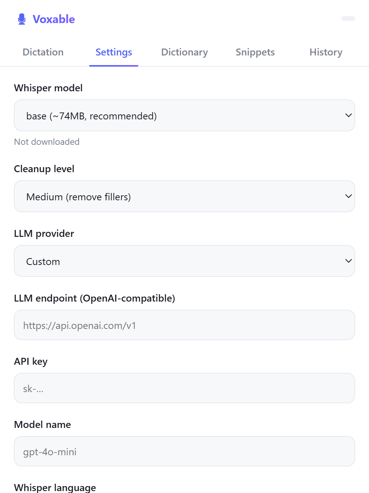

# Voxable

**Local voice dictation with AI cleanup — a Wispr Flow alternative that runs entirely on your machine.**

Press a hotkey, speak, and polished text is typed straight into whatever field you're in. Transcription is local (Whisper via whisper.cpp); an optional LLM pass cleans up filler words, punctuation, and grammar. No subscription, no cloud required.

<p align="center">
  
  <br/><br/>
  
  <br/>
  <em>The Flow Bar floats quietly on top and never steals focus — hit the hotkey, speak, and the text lands in your active app.</em>
</p>

---

## Download

| Platform | Download | Notes |
|---|---|---|
| **macOS** (Apple Silicon) | [**Voxable_0.5.0_aarch64.dmg**](https://github.com/kamicrafted/voxable/releases/download/v0.5.0/Voxable_0.5.0_aarch64.dmg) | Metal-accelerated. macOS 11+. Apple Silicon only — no Intel build. |
| **Windows** (any x64) | [**Voxable_0.5.1_x64_cpu-setup.exe**](https://github.com/kamicrafted/voxable/releases/download/v0.5.1-windows/Voxable_0.5.1_x64_cpu-setup.exe) · [`.msi`](https://github.com/kamicrafted/voxable/releases/download/v0.5.1-windows/Voxable_0.5.1_x64_cpu_en-US.msi) | ~3 MB. Runs anywhere, no GPU needed. **Start here.** |
| **Windows** (NVIDIA GPU) | [**Voxable_0.5.1_x64_cuda-setup.exe**](https://github.com/kamicrafted/voxable/releases/download/v0.5.1-windows/Voxable_0.5.1_x64_cuda-setup.exe) | ~380 MB. Faster transcription and `large-v3`. Bundles the CUDA runtime — no toolkit needed, works on RTX 20xx–50xx. |

Every version lives on the [releases page](https://github.com/kamicrafted/voxable/releases).

**Neither build is notarized or signed with a paid certificate**, so the OS will object the first time:

- **macOS** — Gatekeeper refuses to open it. Right-click the app → **Open**, then **Open** again in the
  dialog. Once per install. Voxable also asks for **Microphone** and **Accessibility** on first
  launch; Accessibility is what lets it watch the hotkey and paste for you.
- **Windows** — SmartScreen warns. Click **More info → Run anyway**.

The first dictation downloads a Whisper model (~148 MB for `base`), so it takes a moment longer than
the rest.

---

## How it works

1. **Record** — press the hotkey (`fn` on macOS, `Win`+`Alt`+`Space` on Windows) or click the Flow Bar. Tap to start and stop; hold it to talk and release when you're done.
2. **Transcribe** — a local Whisper model turns speech into text.
3. **Expand** — snippet triggers are replaced (e.g. `brb` → `be right back`).
4. **Clean up** — an optional LLM pass (any OpenAI-compatible API) fixes fillers/punctuation/grammar and applies your dictionary corrections.
5. **Paste** — the result is copied to the clipboard and pasted into the focused field (macOS and Windows).

## Features

- **Two-window UI** — a minimal **Flow Bar** for the daily loop + a tabbed **Hub** (Home, Dictation, Settings, Dictionary, Snippets, History).
- **A Flow Bar that gets out of the way** — frosted glass that matches your light or dark appearance, shrinking to a mic dot after a moment idle and expanding when you dictate. The dot stays draggable, so it never has to reappear before you can move it (macOS).
- **Audible start and stop** — two ascending notes when recording begins, one lower note when it ends, so you are never unsure whether it heard you.
- **Focus-preserving auto-paste** — the Flow Bar never takes focus, so text lands in your active app (macOS and Windows).
- **Tap or hold** — tap the hotkey for hands-free dictation, or hold it for push-to-talk that ends when you let go. No mode to set (macOS).
- **`fn` as the hotkey on macOS** — the Globe key does nothing useful by default, and it needs no chord. Any combination works too; the recorder captures a real keypress and checks the OS will allow it.
- **4-level cleanup** — none / light / medium / high, or your own custom prompt.
- **Dictionary that actually teaches Whisper** — your names and terms are fed to the decoder so it spells them right in the first place, and anything it still gets wrong is corrected in the transcript. No LLM key needed.
- **Checks for updates** on launch and from the menu bar, and tells you what changed.
- **Snippets** — whole-word, case-insensitive trigger → expansion. Triggers are taught to Whisper too, so an unusual phrase is transcribed as written and actually matches.
- **History with audio** — every dictation stored with its recording (14-day retention, playback in the Hub).
- **Local & private** — audio and transcripts never leave your machine (unless you point cleanup at a remote LLM).
- **GPU optional** — CPU works everywhere; CUDA (NVIDIA) / Metal (Apple Silicon) for faster transcription.
- **LLM presets** — OpenAI, DeepSeek, Groq, Ollama, LM Studio, or any OpenAI-compatible endpoint.
- **Usage at a glance** — the Hub's Home tab shows words dictated, time saved, words per minute, your most-used app, and your recent dictations.
- **Guided permissions** — first launch walks through Microphone and Accessibility, links straight to the right System Settings pane, and prompts nothing until you press the button (macOS).

---

## Install

Prefer a prebuilt app? See [Download](#download) above. To build it yourself — it's a normal Tauri
app — pick your platform below. Full details and troubleshooting live in [BUILD.md](BUILD.md).

### Common prerequisites (all platforms)

- [Rust](https://rustup.rs) (stable, MSVC toolchain on Windows)
- [Node.js](https://nodejs.org) 18+
- **CMake** and **LLVM/Clang** (whisper.cpp needs CMake; `whisper-rs` bindgen needs `libclang`)

### 🪟 Windows

```powershell
# Prereqs: VS 2022 Build Tools (C++ workload), CMake, LLVM, Node, Rust (MSVC)
$env:LIBCLANG_PATH = "C:\Program Files\LLVM\bin"
npm install
npm run tauri build            # CPU build (portable)
```

Installer output: `src-tauri\target\release\bundle\` (`.msi` + NSIS `-setup.exe`). Installs to `%LOCALAPPDATA%\Voxable\`.

**NVIDIA GPU (CUDA):** the CPU build already works; for GPU acceleration see the CUDA sections in [BUILD.md](BUILD.md). Two scripts:
- `scripts\build-installers.ps1` — the **release build**: CPU (portable) **and** the self-contained, multi-GPU CUDA installer. This is what the published installers are built with.
- `scripts\build-cuda-shareable.ps1` — just the CUDA half of the above (bundles the CUDA runtime DLLs; runs on any Windows machine with an NVIDIA driver — no toolkit/PATH needed, works on RTX 20xx–50xx). ~400 MB. `build-installers.ps1` calls this.

> CUDA 13 keeps its runtime DLLs in `…\CUDA\vX.Y\bin\x64\` (not on PATH), so a plain CUDA build fails at launch with `cublas64_13.dll not found`. The shareable script bundles them; see BUILD.md.

### 🍎 macOS

```bash
# Prereqs
xcode-select --install     # or a full Xcode install
brew install cmake node    # `brew install llvm` is not needed — Xcode ships libclang
# Rust: https://rustup.rs, then restart your shell

# Build
git clone https://github.com/kamicrafted/voxable.git && cd voxable
./scripts/build-mac.sh     # Metal (Apple Silicon); pass --cpu for a CPU build
```

Output: `target/release/bundle/` — `macos/Voxable.app` and `dmg/Voxable_<version>_aarch64.dmg`.
Unsigned, so the first launch needs right-click → **Open** (or `xattr -dr com.apple.quarantine <app>`).

The script exists because three things need handling on macOS that don't on Windows: the
whisper.cpp deployment target, linking compiler-rt for the Metal backend, and Tauri's DMG
step (which needs Finder automation and `hdiutil convert` — neither works on a managed Mac).
[BUILD.md](BUILD.md#macos-metal--must-be-built-on-a-mac) has the details.

**On macOS, the default hotkey is the `fn` / 🌐 key** and auto-paste is on. Both need the
Accessibility permission, which the first-launch screen walks you through — Voxable never
asks for a permission on its own. Two things worth knowing:

- macOS gives `fn` its own job by default (usually the emoji picker). Set **System Settings
  → Keyboard → "Press 🌐 key to" → Do Nothing** so the key is yours.
- Without Accessibility, Voxable still transcribes and copies to the clipboard; you just
  press the Flow Bar button and paste yourself.

### 🐧 Linux

```bash
# Prereqs: gcc/clang, cmake, libclang, node, rust, plus the usual Tauri/webkit2gtk deps
npm install
npm run tauri build          # CPU; add --features cuda for NVIDIA
```

---

## First run

1. Launch Voxable — the Flow Bar appears at the bottom-center of your screen.
2. **macOS only:** grant **Microphone** and **Accessibility** when the first-launch screen asks. Accessibility is what lets Voxable watch the hotkey and paste into other apps; without it the hotkey does nothing.
3. Open the Hub (tray icon → **Open Voxable**, or right-click the Flow Bar → **Settings**).
4. (Optional) Set your LLM endpoint + API key + model for cleanup. With no key, you get raw Whisper text.
5. Press the hotkey (`fn` on macOS, `Win`+`Alt`+`Space` on Windows), speak, and the text lands in your active field.
6. The first dictation downloads the Whisper model (~148 MB for `base`) and warms up the GPU, so it is slower than every one after it.

## Usage

**Flow Bar** (always-on-top, draggable, non-focus-stealing, shrinks to a dot when idle):
- Click the mic (or tap the hotkey) to start/stop. **Hold** the hotkey instead and dictation ends the moment you release it.
- Status shows a live timer + waveform while recording, then `Pasted ✓` / `Copied ✓`.
- Right-click → context menu: *Paste last · History · Settings · Hide for 1 hour · Quit*.
- Drag to reposition — the position persists.

**Hub tabs:** Dictation (last result) · Settings · Dictionary · Snippets · History (with audio playback).

<p align="center">
  
</p>

---

## Configuration

Settings live in a single JSON file:

| OS | Path |
|----|------|
| Windows | `%APPDATA%\voxable\settings.json` |
| macOS | `~/Library/Application Support/voxable/settings.json` |
| Linux | `~/.config/voxable/settings.json` |

History (index + `.f32` audio) is under `…/voxable/history/`; models under `…/voxable/models/`.

Key fields:

| Setting | Default | Description |
|---------|---------|-------------|
| `whisper_model` | `base` | `tiny` · `base` · `small` · `medium` · `large-v3` |
| `cleanup_level` | `medium` | `none` · `light` · `medium` · `high` |
| `llm_base_url` | `https://api.openai.com/v1` | OpenAI-compatible endpoint |
| `llm_api_key` | *(empty)* | empty = no LLM cleanup (raw text) |
| `llm_model` | `gpt-4o-mini` | model used for cleanup |
| `hotkey` | `Super+Alt+Space` | global dictation hotkey |
| `language` | `en` | Whisper language, or `auto` |
| `auto_paste` | `true` | auto-type result into the active field (Windows); always copies to clipboard |
| `sound_enabled` | `true` | completion beep |
| `custom_prompt` | *(empty)* | overrides the cleanup-level preset |
| `dictionary` | `[]` | `[{ "word": "...", "replacement": "..." }]` |
| `snippets` | `[]` | `[{ "trigger": "brb", "expansion": "be right back" }]` |

Dictionary and snippets are best edited in the Hub (they persist to `settings.json`).

## Whisper models

| Name | Size | Notes |
|------|------|-------|
| `tiny` | 78 MB | fastest, lowest accuracy |
| `base` | 148 MB | **default** — good speed/accuracy balance |
| `small` | 488 MB | better accuracy |
| `medium` | 1.5 GB | good accuracy |
| `large-v3` | 3.1 GB | best accuracy, slowest (GPU recommended) |

Downloaded from HuggingFace (`ggerganov/whisper.cpp`) on first use.

---

## Architecture

Cargo **workspace**:

- **`voxable-core/`** — pure, host-independent logic (config, snippets, prompt building, history, VAD). No Tauri/OS deps; fully unit-tested (`cargo test -p voxable-core`).
- **`src-tauri/`** — the Tauri v2 app: audio capture (cpal), Whisper (whisper-rs), LLM cleanup (reqwest), the two-window shell, tray, global hotkey, and Win32 helpers (foreground-app context, non-activating Flow Bar, synthesized paste).

Frontend is vanilla JS + Vite (multi-page: `index.html` = Hub, `flowbar.html` = Flow Bar). Rust is the single source of truth; both windows invoke the same commands, and the global hotkey is the sole dictation trigger.

**Stack:** Tauri 2 · whisper-rs 0.16 · cpal 0.15 · reqwest · Vite 5.

## Notes & limitations

- **Max recording:** 2 minutes per session (auto-stops).
- **Very short utterances are ignored.** Under 250ms of speech returns nothing rather than a guess — Whisper does not fail on a fragment that short, it invents words.
- **LLM is optional** — no key = raw Whisper text (still useful).
- **GPU is optional** — CPU is fine; GPU is ~5–10× faster for transcription. CUDA builds are not portable unless built with the shareable script; Metal builds run on macOS only.
- **Auto-paste** works on macOS and Windows; Linux would need an equivalent.
- **Push-to-talk is macOS-only.** It needs the key release, which the macOS event tap reports and a registered global shortcut does not. Windows taps to toggle.
- **Not code-signed** — expect SmartScreen (Windows) / Gatekeeper (macOS) on first launch.

Dev/build details: [BUILD.md](BUILD.md) · Project state: [PROJECT_STATE.md](PROJECT_STATE.md)

## License

[MIT](LICENSE) © Dave Yoon
